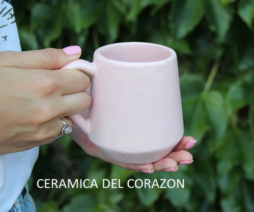

#Proyecto Ceramica
##curso CoderHouse React
##comision 34770
_autor: Pesoa Sergio_
```Descripción```
El escenario previsto para el proyecto es una tienda Online de venta de productos artesanales de Cerámica, el emprendimiento es real de ahi que las imagenes representen las piezas realizadas en dicho emprendimiento.
Para el desarrollo de algunas utilidades en el codigo se utilizaron varias librerias, como "mui components", "sweet alert", "firebase" y obviamente de la propia libreria de React ( react Router Dom ).
el repo esta subido en github.com/sergiopesoa/prueba 
para poder reproducirlo sigue estos pasos :
a- clona el repo
b- realiza un npm instal
c-realiza un npm start 




#Noviembre 2022 , Paraná , Entre Rios